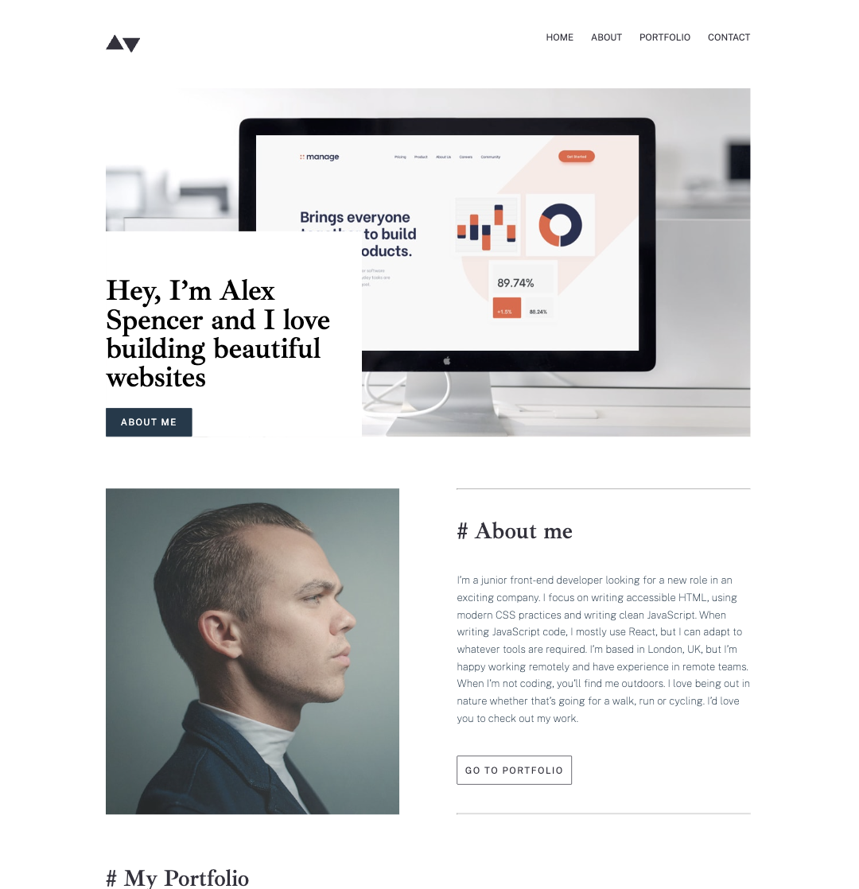

# English

# Frontend Mentor - Minimalist portfolio website solution

This is a solution to the [Minimalist portfolio website challenge on Frontend Mentor](https://www.frontendmentor.io/challenges/minimalist-portfolio-website-LMy-ZRyiE). Frontend Mentor challenges help you improve your coding skills by building realistic projects. 


## Project Overview

This project is a minimalist portfolio website created to showcase my web development skills. It emphasizes responsive design and dynamic interactivity using HTML5, CSS3, and JavaScript. The website uses a mobile-first approach and incorporates CSS Grid for flexible layout management across different screen sizes. Throughout this project, I focused on best practices for modern front-end development, improving performance and ensuring the website is visually appealing and user-friendly on various devices.


## Live website

See the live website [here ](https://minimalist-static-portfolio.netlify.app/).


### Screenshot




## To clone this repository

Open the terminal in the folder where you want to save the project and open VS Code. Then type the following commands:

```bash
# Clone the repository
git clone https://github.com/giuliadev95/minimalist-portfolio-website.git

# Enter the project folder
cd minimalist-portfolio-website

# Open the project in VS Code
code .
```


## Features

1. Responsive Design (Mobile-First)

	•	The website follows a mobile-first design approach, making sure it looks great on small devices first, and then enhancing the layout for larger screens like tablets and desktops.
	•	Media queries are used to handle breakpoints for tablets (768px) and desktops (1024px), ensuring a smooth transition between devices.
	•	The layout adapts dynamically using CSS Grid to adjust content positioning depending on the screen width.

2. CSS Grid Layout

	•	CSS Grid is used extensively to create flexible and responsive layouts for the main sections, such as the hero section, portfolio projects, and contact form.
	•	The grid structure is designed to easily switch between layouts, with grid-template-areas used to rearrange project sections on larger screens, allowing for different column orders (e.g., reversing image and text in the portfolio section).

3. Interactive JavaScript Features

	•	JavaScript is used to dynamically change image sources based on the current screen size, ensuring that the appropriate image is loaded for mobile, tablet, or desktop devices.
	•	The hamburger menu is implemented for smaller screens, allowing for a collapsible navigation bar. Clicking the menu icon toggles the visibility of the navigation links.
	•	Smooth scrolling functionality is added to buttons such as “Go to About Me” and “Go to Portfolio”, enhancing the user experience.

---

# ITALIANO

# Frontend Mentor 

Questa è una soluzione per la [sfida "Minimalist portfolio website", su Frontend Mentor](https://www.frontendmentor.io/challenges/minimalist-portfolio-website-LMy-ZRyiE). Le sfide di Frontend Mentor aiutano a migliorare le competenze di responsive design in HTML, CSS e JavaScript.


## Panoramica del progetto

Questo progetto è un sito portfolio minimalista creato per mostrare le mie competenze nello sviluppo web. Pone l'accento sul design responsive e sull'interattività dinamica utilizzando HTML5, CSS3 e JavaScript. Il sito adotta un approccio mobile-first e integra CSS Grid per una gestione flessibile del layout su diverse dimensioni dello schermo. Durante lo sviluppo del progetto, mi sono concentrato sulle best practice per il front-end moderno, migliorando le performance e assicurando che il sito fosse visivamente accattivante e facile da usare su vari dispositivi.


## Sito live

Visualizza il sito live [qui](https://minimalist-static-portfolio.netlify.app/).


### Screenshot


## Per clonare questo repository

Apri il terminale nella cartella in cui vuoi salvare il progetto e apri VS Code. Poi digita i seguenti comandi:

```bash
# Clona il repository
git clone https://github.com/giuliadev95/minimalist-portfolio-website.git

# Entra nella cartella del progetto
cd minimalist-portfolio-website

# Apri il progetto in VS Code
code .
```


## Caratteristiche

1. **Design responsive (Mobile-First)**

   • Il sito segue un approccio di design mobile-first, assicurandosi che abbia un ottimo aspetto prima sui dispositivi piccoli e poi migliorando il layout per schermi più grandi come tablet e desktop.  
   • Le media query sono utilizzate per gestire i breakpoint per tablet (768px) e desktop (1024px), garantendo una transizione fluida tra i dispositivi.  
   • Il layout si adatta dinamicamente usando CSS Grid per regolare il posizionamento dei contenuti in base alla larghezza dello schermo.

2. **Layout CSS Grid**

   • CSS Grid è ampiamente utilizzato per creare layout flessibili e responsive nelle sezioni principali, come l’hero, i progetti del portfolio e il form di contatto.  
   • La struttura a griglia è progettata per passare facilmente tra diversi layout, usando `grid-template-areas` per riorganizzare le sezioni dei progetti su schermi più grandi, permettendo ordini di colonna diversi (ad esempio, invertendo immagine e testo nella sezione portfolio).

3. **Funzionalità interattive con JavaScript**

   • JavaScript viene utilizzato per cambiare dinamicamente le sorgenti delle immagini in base alla dimensione dello schermo, assicurando che l’immagine corretta venga caricata su dispositivi mobile, tablet o desktop.  
   • Il menu hamburger è implementato per schermi più piccoli, permettendo una barra di navigazione collassabile. Cliccando sull’icona del menu si attiva o disattiva la visibilità dei link di navigazione.  
   • È stata aggiunta la funzionalità di smooth scroll per i pulsanti, migliorando l’esperienza utente.
